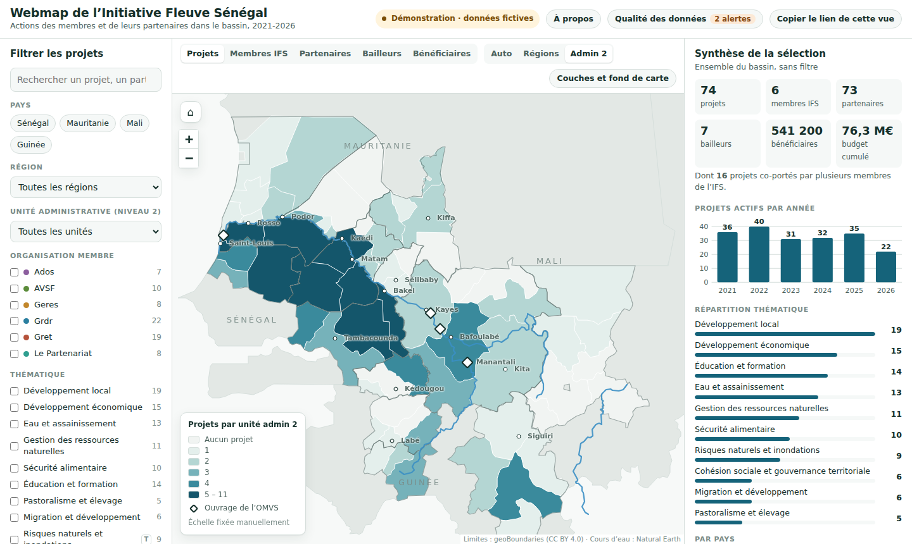

# Webmap de l’Initiative Fleuve Sénégal (démonstration)

**Démo en ligne : https://mawa399.github.io/webmap-ifs-demo/**
· [Intégration dans un autre site](https://mawa399.github.io/webmap-ifs-demo/integration.html)
· [Dictionnaire des données](docs/dictionnaire-donnees.md)

Prototype de cartographie interactive des actions menées par les membres de l’**Initiative Fleuve Sénégal (IFS)** et leurs partenaires dans le bassin du fleuve Sénégal (Sénégal, Mauritanie, Mali, Guinée), sur la période 2021-2026. Il a été réalisé pour la candidature à l’appel d’offres de l’IFS et reproduit, à petite échelle, **l’ensemble de la chaîne proposée** : collecte Kobo, contrôle qualité, carte, diffusion et mise à jour par des non-techniciens.

> ⚠️ **Données fictives.** Les projets, montants, partenaires, bailleurs et la couche historique sont inventés pour la démonstration. Les limites administratives, les cours d’eau et les villes sont réels. Deux lignes du fichier de projets contiennent des **anomalies volontaires** pour montrer le contrôle qualité.



## Ce que la démo couvre, point par point

| Exigence des termes de référence | Dans la démo |
|---|---|
| Unités administratives admin 0, 1 et 2 | Pays, 15 régions et leurs unités de niveau 2 (départements, cercles, moughataa, préfectures) |
| Informations issues de la collecte : projets, intervenants, partenaires, bailleurs, bénéficiaires, thématiques | Cinq indicateurs cartographiés, thématiques en filtre et en graphique |
| Couches indépendantes, superposées et désactivables, avec légende | Aplats par unité + cercles proportionnels des bénéficiaires + fleuve et villes + ouvrages OMVS + historique, activables séparément, légende dynamique |
| Niveau agrégé selon le zoom | Bascule automatique régions → unités de niveau 2, ou échelle fixée manuellement |
| Niveau projet : liste puis fiche détaillée | Clic sur une unité → liste des projets → fiche (porteur, co-porteurs, thématiques, ODD, état, années, résumé, partenaires, bailleurs, budget, bénéficiaires) |
| Fenêtre ou volet par unité de niveau 2 | Volet latéral avec indicateurs, membres présents, thématiques, projets et rappel 2010-2020 |
| Espace de synthèse avec graphiques et indicateurs | Chiffres clés, projets actifs par année, répartitions par thématique, pays, organisation et bailleur |
| 8 thématiques + 2 entrées transversales | Nomenclature dans `data/thematiques.csv`, entrées transversales signalées « T » |
| Couche historique Traverses n°50, distincte et non actualisée | Couche séparée, signalée comme telle, exclue de la mise à jour |
| Couches de contexte | Exemple : ouvrages de l’OMVS ; toute nouvelle couche s’ajoute dans `data/geo/` |
| Informations de contexte (membres, bassin) | Panneau « À propos », alimenté par `data/contexte.json` et `data/organisations.csv` |
| Outils de navigation standard | Zoom, retour à la vue initiale, couches visibles ou cachées, **choix du fond de carte** (sobre, OpenStreetMap, plan clair, satellite) |
| Filtres croisés : pays, régions, admin 2, organisation, thématique, bailleur, partenaire, état, période | Tous présents et combinables ; carte, agrégats et synthèse recalculés à chaque changement |
| Page autonome indexable | Balises de référencement, Open Graph, données structurées, `sitemap.xml`, `robots.txt` |
| Intégration par iframe (Sahelink, sites des membres) | Mode `?embed=1` et page [`integration.html`](integration.html) avec le code à copier |
| Mise à jour sans compétence technique à partir d’exports Kobo | Remplacer `data/projets.csv` suffit ; guide pas à pas présenté lors de l’entretien |
| Modification des informations de contexte | Fichiers texte éditables depuis GitHub, sans toucher au code |
| Outil responsive | Ordinateur, tablette et mobile ; modes clair et sombre |
| Architecture évolutive | Données séparées du code, référentiels en CSV, couches ajoutables sans développement |

**Au-delà des TDR** : contrôle qualité automatique (sur la carte et sur GitHub), liens partageables qui conservent les filtres, export CSV de la sélection, recherche par mot-clé, indicateur des projets co-portés, formulaire Kobo prêt à l’emploi (présenté lors de l’entretien).

## Structure du dépôt

```
index.html                  Page autonome (référence)
integration.html            Mode d’emploi de l’intégration par iframe
assets/app.js               Application (Leaflet, sans framework)
assets/style.css            Styles, thèmes clair et sombre
data/projets.csv            ← export Kobo : le seul fichier à remplacer pour mettre à jour la carte
data/unites_admin.csv       Référentiel des unités de niveau 2 et de leurs codes
data/organisations.csv      Membres de l’IFS
data/thematiques.csv        Nomenclature thématique
data/historique_traverses50.csv  Couche historique 2010-2020
data/contexte.json          Textes de présentation
data/geo/                   Limites, cours d’eau, ouvrages OMVS (GeoJSON simplifiés)
scripts/valider_donnees.py  Contrôle qualité (Python, sans dépendance)
.github/workflows/          Contrôle automatique à chaque mise à jour de data/
docs/                       Dictionnaire des données
```

## Chaîne de mise à jour

1. **Collecte** : chaque membre remplit un formulaire Kobo dédié (disponible sur demande). Listes déroulantes pour les unités, thématiques et organisations, contrôles de saisie sur les dates et les montants.
2. **Dépôt** : l’équipe exporte les réponses en CSV et dépose le fichier dans `data/` depuis l’interface web de GitHub.
3. **Contrôle** : `scripts/valider_donnees.py` s’exécute automatiquement (onglet *Actions*) et produit un rapport. La carte applique les mêmes règles et les affiche dans « Qualité des données ».
4. **Publication** : GitHub Pages republie le site en une à deux minutes. Les lignes en erreur sont écartées ; le reste de la carte reste en ligne.

## Règles de calcul

- Un projet présent dans plusieurs unités est compté dans chacune, mais **une seule fois** dans les totaux d’une région et du bassin.
- Les bénéficiaires sont sommés par unité à partir de leur ventilation par zone ; le budget est affiché au niveau du projet.
- Un projet est retenu s’il est actif au moins une année dans la période choisie.

## Technologies

| Composant | Choix |
|---|---|
| Carte | [Leaflet](https://leafletjs.com/) 1.9.4 |
| Lecture des CSV | [Papa Parse](https://www.papaparse.com/) |
| Interface et graphiques | HTML, CSS et JavaScript sans framework, graphiques en SVG |
| Contrôle qualité | Python 3 (bibliothèque standard), GitHub Actions |
| Préparation des géométries | Shapely et [mapshaper](https://github.com/mbloch/mapshaper) |
| Hébergement | GitHub Pages (gratuit) |

Poids total des données : environ 300 Ko, pour rester consultable sur une connexion mobile.

## Lancer en local

Le navigateur doit charger les fichiers de `data/` : ouvrir `index.html` par double-clic ne suffit pas. Depuis le dossier du projet :

```bash
python -m http.server 8000
```

puis ouvrir http://localhost:8000. Pour contrôler les données : `python scripts/valider_donnees.py`.

## Sources

- Limites administratives : [geoBoundaries](https://www.geoboundaries.org/) (gbOpen), CC BY 4.0. Découpage indicatif, à valider avec l’IFS.
- Cours d’eau : [Natural Earth](https://www.naturalearthdata.com/), domaine public.
- Ouvrages de l’OMVS : positions approximatives.
- Contexte : [Traverses n°50 – Quelles synergies d’intervention dans le Bassin du fleuve Sénégal ?](https://grdr.org/IMG/pdf/traverses_50.pdf), Groupe initiatives, 2022.

## Auteur

**Mawa DIAW**, géomaticien et développeur SIG · [LinkedIn](https://www.linkedin.com/in/mawa-diaw)

## Licence

© 2026 Mawa DIAW, tous droits réservés (voir [LICENSE](LICENSE)). Démonstration consultable ; toute réutilisation du code nécessite un accord écrit. Les données géographiques restent soumises à la licence de leur source.
